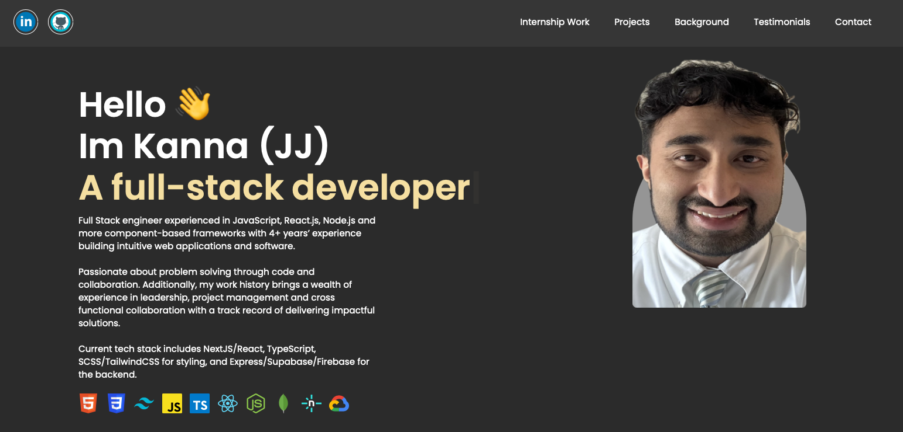
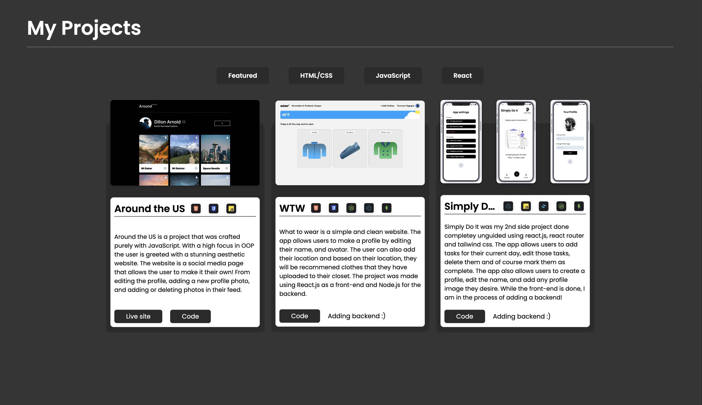
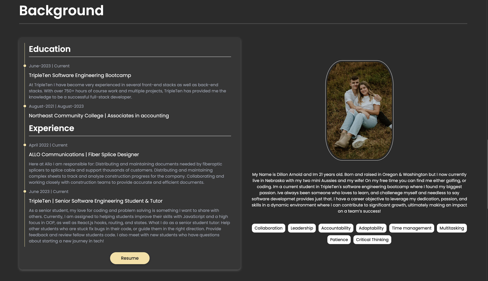
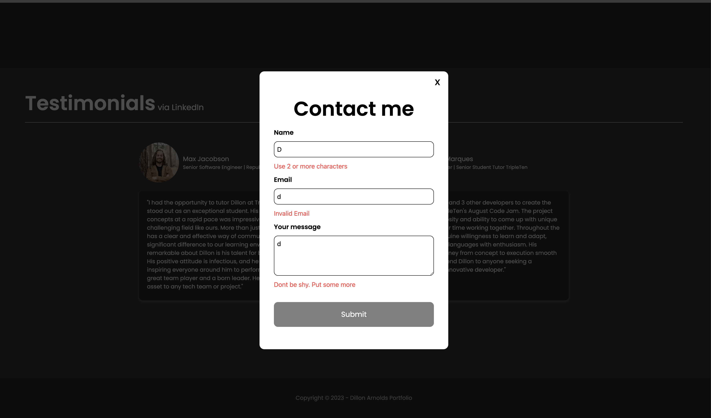

# About my portfolio

This project is my portfolio website. Here you can find out more about me, the work I do, and my brackground!
 
The project was made using React.js and tailwind css to create a smooth and amazing UI. It features multiple modals, a form that is fully validated and a projects section where the user can filter projects by the tech stack. In the future Id love to add a backend for Admins to make it easier to add and store projects without having to touch the code base.

# Images from the project

# Live site

www.kannasportfolio.com
